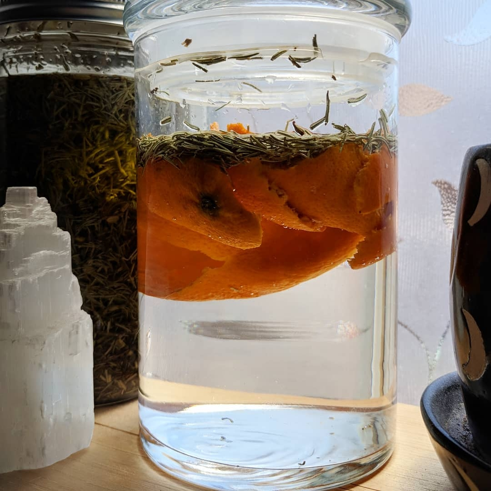

# Herbs to Help You Out

This collection of monographs serves a way to organize herbal recipes as I find and discover them. This is a living document and will constantly growing and changing. I have no medical background, so use this information with the knowledge that I am simply a curious researcher and enjoy making things in the kitchen.

Photos by [Carolee](https://www.instagram.com/theblackandthered/)

## Standard Disclosure
Avoid using the same herb for extended periods of time. If the condition has not improved; change to a different herb or seek consultation.

For educational purposes only. This information has not been evaluated by the Food and Drug Administration.

This information is not intended to diagnose, treat, cure, or prevent any disease.